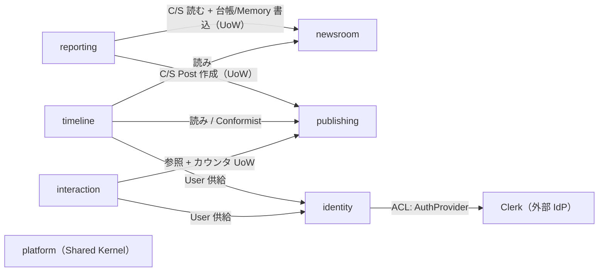

# ドメインモデル(戦略 DDD)

> 全体像は [`overview.md`](./overview.md)。本書は **why と境界**(サブドメイン区分・コンテキストマップ・集約境界・横断不変条件・ドメインイベント)を残す。永続化スキーマは [`data-model.md`](./data-model.md)、各 Phase の戦術詳細は [`../specs/`](../specs/index.md) を正典とする。

## 1. サブドメイン区分

| 区分 | context | 根拠 |
|---|---|---|
| **Core**(自前で磨く) | `reporting` / `newsroom` / `publishing` | 「取材→出典付きつぶやき」「記者の進化」「不変の公開履歴・AI 明示」= 競合優位そのもの |
| **Supporting**(必要だが定石) | `timeline` / `interaction` | フォロー/フィード/いいね・コメントは SNS の定石。差別化は「記者を組み合わせる」使い方側 |
| **Generic**(委託・汎用) | `identity`(Clerk)/ `platform`(技術基盤) | 認証は Clerk へ委譲し User は薄い鏡。platform は技術的 Shared Kernel |

Core の 3 つ = **Phase 1 で作る 3 つ**。フェーズ分割が「価値の中核から作る」になっている。

## 2. コンテキストマップ

- **reporting = 下流オーケストレータ**: newsroom・publishing の **app interface 経由**で読み書きし、互いの `internal` は直接触らない(depguard で強制)。書き込みは [UoW(ADR-0013)](../adr/0013-cross-context-unit-of-work.md) で 1 tx。
- **timeline = Conformist(読み)**: 上流に合わせるだけの CQRS-lite read model([backend.md](./backend.md) §6)。
- **identity ↔ Clerk = ACL**: `AuthProvider` 抽象が Clerk を local `User` に翻訳([ADR-0004](../adr/0004-auth-clerk.md))。
- **認可**: 各 app use case が `can(actor, action, resource)` ポリシー seam で判定(下記 §4)。

## 3. 集約(ルートと境界)

| context | 集約ルート | 同一集約に含む | 別集約は ID 参照 | 性質 / 状態 |
|---|---|---|---|---|
| newsroom | **Correspondent** | Persona・Field・FrequencyPolicy(VO) | owner→User | status |
| newsroom | **NotebookEntry**(観測台帳) | — | correspondent_id | **追記のみ**(observation)= 真実源 |
| newsroom | **CorrespondentMemory** | — | correspondent_id(1:1) | **可変・AI が都度更新**(consolidated)/ 楽観ロック |
| reporting | **ReportingRun** | search_queries・cost(VO) | correspondent_id, produced_post_id | queued→running→succeeded/failed(冪等) |
| publishing | **Post** | **Source[]・Image(0..1)・PostLink[]** | correspondent_id, reporting_run_id | **公開後不変** |
| identity | **User** | Roles(VO) | — | Clerk 鏡 |
| timeline | **Follow** | — | user_id, correspondent_id | 人→記者のみ |
| interaction | **Like** / **Comment** / **Ask ▸ AskMessage[]** | Ask が AskMessage を内包 | post_id, user_id | Ask は本人のみ・上限 |

### 主要な集約境界の判断(why)

- **Notebook はハイブリッド**(2 集約に分離):append-only の **観測台帳(`NotebookEntry`)を真実源**(来歴・TDD・rollback の土台)にし、その上に **AI が都度書き換える `CorrespondentMemory`**(LLM に渡す主役)を 1 枚載せる。純上書き型を避ける理由 = lossy(知見消失)・非決定で TDD しづらい・並行 run の lost-update。Memory は楽観ロック(version)で更新し、最悪は台帳から再生成できる。検索戦略は [Notebook spec](../specs/2026-06-22-notebook-retrieval-and-dedup-design.md)。
- **Source / Image / PostLink は Post 集約の内部**:出典≥1・AI 明示の不変条件を境界内で原子的に守る。**`PostLink[]` は外向き typed link**(続報 / 訂正 / 関連)で過去 Post の進展を表現。新 Post 公開時に同一 UoW で追加し、参照先の旧 Post は変更しない(**追加のみで Post 不変性を維持**)。
- **Notebook を Correspondent に内包しない**:append-only で無限に育つため、内包すると集約が肥大化し読み込めなくなる。

## 4. 認可モデル(加算式 Roles + ポリシー seam)

- `User.Roles` は **加算式の集合**:全員が `user` 基底を持ち、`administrator` は **追加付与**(`admin ⊇ user`)。**admin も普通の user として振る舞える**。
- 判定は **`can(actor, action, resource)` ポリシー seam** に集約する。呼び出し側はこの 1 関数を通すので、いまの「owner か admin か」から **将来の細粒度 permission へ seam の中身差し替えだけで drop-in**(call site 不変)。RBAC テーブル等は今は作らない(YAGNI)。
- enforcement は認証が入る **Phase 2**(Phase 1 は auth 無しで公式記者を seed 投入)。

## 5. 横断不変条件(ドメインで強制する製品ルール)

1. Post は公開後 **不変**・閲覧者非依存(publishing)
2. report⇒出典≥1 / opinion⇒0 可+意見フラグ必須(publishing)
3. `images.ai_generated` 常 true(publishing)
4. Ask は asker 本人のみ閲覧・回数上限(interaction)
5. フォロー/いいね/コメント/質問は 人→記者・投稿 の一方向(timeline/interaction)
6. official⇒owner=null / custom⇒owner必須 / private⇒所有者 or **admin**(newsroom)
7. 取材は `reporting_run_id` で冪等・二重課金/重複 Post 禁止([ADR-0011](../adr/0011-reporting-idempotency.md))
8. 越境書き込みは 1 tx の UoW([ADR-0013](../adr/0013-cross-context-unit-of-work.md))
9. 規制分野(医療・法務・投資)は policy で免責付与 or ブロック([ADR-0014](../adr/0014-regulated-domain-guardrails.md))
10. AI コストは per-run + 予算上限で事前ガード([ADR-0012](../adr/0012-ai-cost-guardrails.md))
11. 認可は `can(actor,action,resource)` seam で判定(`admin ⊇ user`)(identity)
12. Notebook 台帳は追記のみ / Memory は可変・楽観ロックで lost-update 回避(newsroom)

## 6. ドメインイベント(文書化のみ・将来 Pub/Sub seam)

「名前・発火点・将来の消費先」を予約するだけで、**ディスパッチャは作らない**。Phase 1 の越境調整は同期 UoW で足りる(YAGNI)。fan-out が要る将来に Pub/Sub で実消費する([infrastructure.md](./infrastructure.md))。

| イベント | 発火点 | 将来の consumer | 初登場 |
|---|---|---|---|
| `PostPublished` | Post 公開 | timeline 投影(fan-out)・Chief・通知 | Ph1 記録 / Ph2 実消費 |
| `ReportingRunSucceeded` | run→succeeded | 発信頻度の自己調整・コスト集計 | Ph1 |
| `NotebookEntryRecorded` | observation 追記 | 要約圧縮トリガ・進化メトリクス | Ph1 |
| `CorrespondentMemoryUpdated` | run ごとに Memory 更新 | 進化メトリクス・品質監視 | Ph1 |
| `CorrespondentFollowed` | フォロー | timeline backfill・推薦 | Ph2 |
| `PostLinked` | 続報/訂正 付与 | スレッド表示・通知 | Ph2 |
| `PostLiked` / `Commented` | 反応 | 人気ランキング・通知 | Ph3 |
| `AskOpened` / `Answered` | 質問/回答 | 通知・上限会計 | Ph3 |

### timeline 配信方針(布石)

Phase 2 は **fan-out-on-read**(フォロー集合の Post をカーソル取得)を基本にし、規模が要求したら `PostPublished` を seam に **fan-out-on-write** へ移す。Phase 1 では決めないが、イベントを残す意味はここ。
