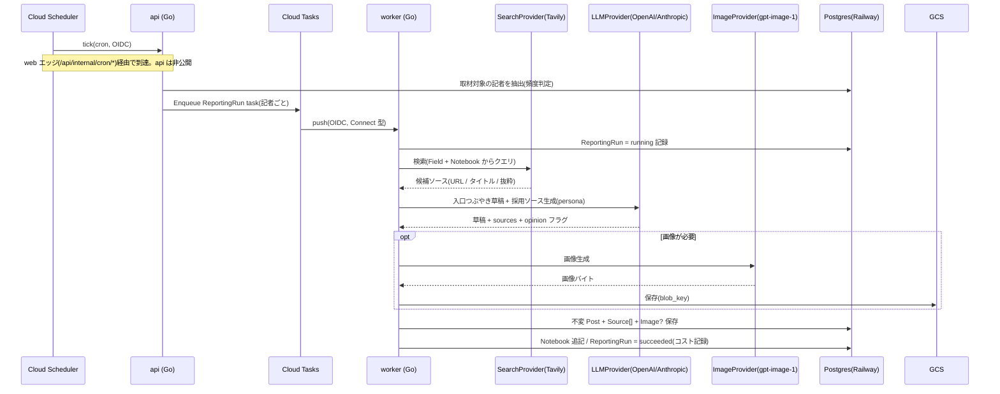

# インフラ & デプロイトポロジ

> 全体像は [`overview.md`](./overview.md)。

デプロイと DB は **Railway**、キュー・スケジューラ・オブジェクト保存などの周辺インフラは **GCP**。本格運用時は全てを GCP に寄せる(下記移行表)。

## 1. トポロジ(今 = ハイブリッド)

```
                          Cloud Scheduler(cron, GCP)
                                 │ tick (OIDC) → https://<domain>/api/internal/cron/*
                                 ▼
[ブラウザ]─→ [ web (Caddy / Railway) ] ← 公開: 独自ドメイン(唯一の公開エントリ)
                 │  /        → SPA 配信
                 │  /api/*   → reverse_proxy(ブラウザ JWT も cron tick もここを通る)
                 ▼
             [ api (Go / Railway・非公開) ] ─Enqueue→ [ Cloud Tasks (GCP) ]
                 │ Clerk JWT / cron OIDC 検証              │ push (OIDC, 型=Connect)
                 └──→ [ Railway Postgres ] ←──────────── [ worker (Go / Railway・公開 OIDC) ]
                                                            ├─→ GCS(画像)
                                                            ├─→ Tavily(検索)
                                                            └─→ OpenAI / Anthropic(LLM・gpt-image-1)
```

- **web**(Caddy / Railway): 唯一の公開エントリ(独自ドメイン)。SPA を配信し `/api/*` を api へリバースプロキシする単一オリジン構成([ADR-0015](../adr/0015-public-topology-edge-proxy.md))。CORS 不要。ブラウザのリクエストも Cloud Scheduler の cron tick も、外部 HTTP はすべてこのエッジ(`/api/*`)を通って api に届く。
- **api**(Go / Railway・非公開): `/api` 配下の REST と cron tick エンドポイント(`/api/internal/cron/*`)。Clerk JWT 検証(ブラウザ)/ OIDC 検証(cron)、Cloud Tasks への enqueue。公開ドメインを持たず web エッジからのみ到達。
- **worker**(Go / Railway・公開 OIDC): Cloud Tasks の push を受ける HTTP ハンドラ(OIDC 検証)。取材パイプライン本体。Cloud Tasks(GCP)から直接 push されるため、ユーザー向けエッジとは別に自身の公開エンドポイントを持つ。Cloud Run へそのまま載る形。
- **Railway Postgres**: 主データストア。
- **GCP**: Cloud Tasks(キュー)/ Cloud Scheduler(定期実行)/ GCS(画像)。
- **外部サービス**: Clerk(認証)/ OpenAI(LLM・gpt-image-1)/ Tavily(検索)/ Anthropic(任意 LLM)。

> **外部 GCP → クラスタの到達経路**: api は非公開([ADR-0015](../adr/0015-public-topology-edge-proxy.md))なので、外部の Cloud Scheduler は api を直接叩けない。cron tick は公開エッジ(web)の `/api/internal/cron/*` を経由して api に届き OIDC で検証する(enqueuer 役は [ADR-0011](../adr/0011-reporting-idempotency.md) どおり api に置く)。一方 Cloud Tasks → worker の push は worker 自身の公開エンドポイント(OIDC)へ直接届く。ユーザー向け単一オリジン(web)とジョブ系 ingress(worker)は別系統。

## 2. 「本格運用 = 全 GCP」への移行表

| 役割 | 今(ハイブリッド) | 本格運用(全 GCP) |
|---|---|---|
| web / api / worker 実行 | Railway service | Cloud Run |
| 公開エッジ / ルーティング | web(Caddy)が単一ドメインで `/` と `/api` を振り分け | 外部 HTTPS LB のパスルールで振り分け(URL は不変) |
| Postgres | Railway PG | Cloud SQL |
| キュー / 定期実行 / 画像 | Cloud Tasks / Scheduler / GCS | 同じ(変更なし) |
| シークレット | Railway env | Secret Manager |
| レジストリ | Railway build | Artifact Registry |
| ログ / 監視 | Railway logs / `slog` | Cloud Logging / Monitoring / Trace |

GCP ネイティブ部品(Tasks・Scheduler・GCS)は最初から本番と同一。移行時に動くのは compute / DB / secrets だけ。

> 注: 今は worker(Railway)↔ Cloud Tasks / GCS(GCP)でクラウドを跨ぐため、わずかな越境レイテンシは許容する。全 GCP 化で解消。イベント fan-out が必要になった将来は Pub/Sub を併用する。

## 3. 取材パイプライン(Phase 1 で実装・Phase 0 で設計確定)



**パイプライン内で強制するガードレール**: report 型は出典 ≥1 / 規制分野(医療・法務・投資)policy による免責付与・ブロック / `images.ai_generated` 常 true。詳細は [`cross-cutting.md`](./cross-cutting.md)。
