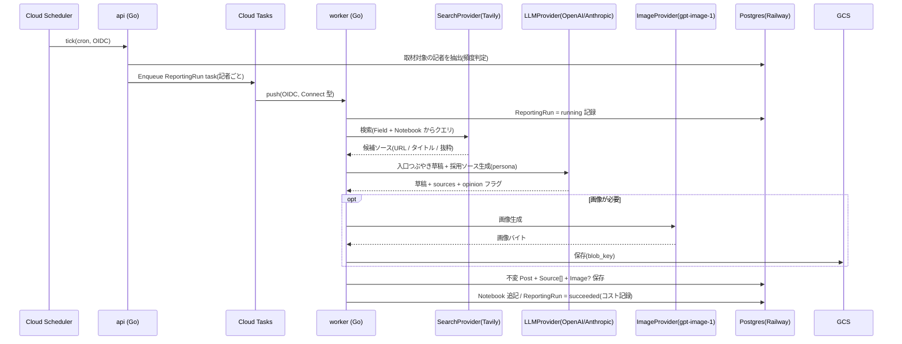

# インフラ & デプロイトポロジ

> 全体像は [`overview.md`](./overview.md)。

デプロイと DB は **Railway**、キュー・スケジューラ・オブジェクト保存などの周辺インフラは **GCP**。本格運用時は全てを GCP に寄せる(下記移行表)。

## 1. トポロジ(今 = ハイブリッド)

```
              Cloud Scheduler(cron, GCP)
                     │ tick (OIDC)
                     ▼
[React SPA]─REST→ [ api (Go / Railway) ] ─Enqueue→ [ Cloud Tasks (GCP) ]
                   │ Clerk JWT 検証                      │ push (OIDC, 型=Connect)
                   │ SPA 静的配信(MVP)                   ▼
                   └────────→ [ Railway Postgres ] ←── [ worker (Go / Railway) ]
                                                          ├─→ GCS(画像)
                                                          ├─→ Tavily(検索)
                                                          └─→ OpenAI / Anthropic(LLM・gpt-image-1)
```

- **api**(Go / Railway): 公開 REST エッジ、Clerk JWT 検証、MVP では SPA 静的配信も担う、Cloud Tasks への enqueue。
- **worker**(Go / Railway): Cloud Tasks の push を受ける HTTP ハンドラ(OIDC 検証)。取材パイプライン本体。Cloud Run へそのまま載る形。
- **Railway Postgres**: 主データストア。
- **GCP**: Cloud Tasks(キュー)/ Cloud Scheduler(定期実行)/ GCS(画像)。
- **外部サービス**: Clerk(認証)/ OpenAI(LLM・gpt-image-1)/ Tavily(検索)/ Anthropic(任意 LLM)。

## 2. 「本格運用 = 全 GCP」への移行表

| 役割 | 今(ハイブリッド) | 本格運用(全 GCP) |
|---|---|---|
| api / worker 実行 | Railway service | Cloud Run |
| Postgres | Railway PG | Cloud SQL |
| キュー / 定期実行 / 画像 | Cloud Tasks / Scheduler / GCS | 同じ(変更なし) |
| シークレット | Railway env | Secret Manager |
| レジストリ | Railway build | Artifact Registry |
| ログ / 監視 | Railway logs / `slog` | Cloud Logging / Monitoring / Trace |

GCP ネイティブ部品(Tasks・Scheduler・GCS)は最初から本番と同一。移行時に動くのは compute / DB / secrets だけ。

> 注: 今は worker(Railway)↔ Cloud Tasks / GCS(GCP)でクラウドを跨ぐため、わずかな越境レイテンシは許容する。全 GCP 化で解消。イベント fan-out が必要になった将来は Pub/Sub を併用する。

## 3. 取材パイプライン(Phase 1 で実装・Phase 0 で設計確定)



**パイプライン内で強制するガードレール**: report 型は出典 ≥1 / 規制分野(医療・法務・投資)policy による免責付与・ブロック / `images.ai_generated` 常 true。詳細は [`cross-cutting.md`](./cross-cutting.md)。
