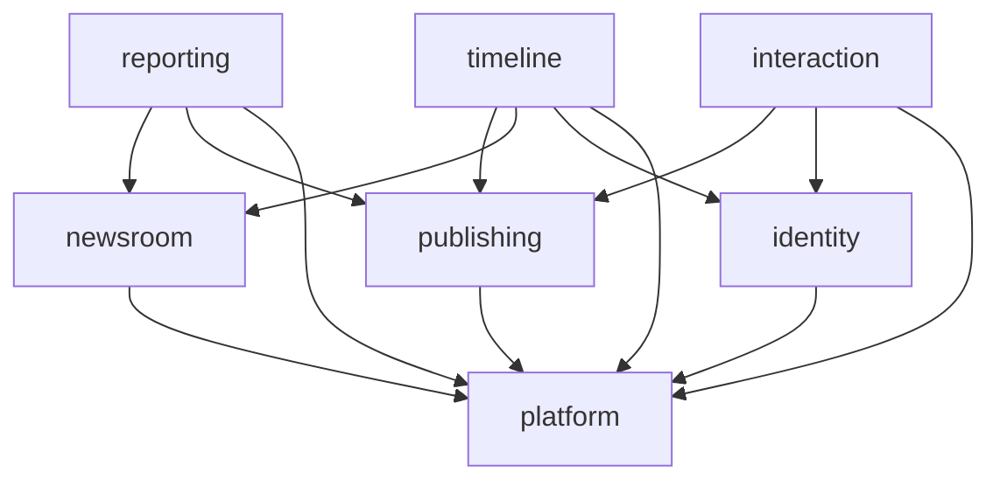

# Dispatch 全体設計(Overview)

> 対象: **Phase 0(基盤・設計先行)**。前提 = [`../concept.md`](../concept.md)。
> 詳細は本ファイルからリンクする各ドキュメントを参照。

## 1. ゴールとスコープ

このフェーズの成果物:

- モノリポと開発ハーネス(CI / lint / format / テスト基盤 / codegen)
- デプロイ可能な空の骨格(health API + 空 SPA + マイグレーション + 疎通経路)
- データモデルとスキーマ
- AI プロバイダ抽象(LLM / Search / Image)
- 主要な意思決定の ADR 化

完了条件: 「実機能は無いが、Phase 1 以降を載せられる土台が動いてデプロイできる」状態。

### 全体の分解

| Phase | 中身 | 成果物 |
|---|---|---|
| **0(本書群)** | モノリポ・スタック・ハーネス・デプロイ骨格・データモデル・AI 抽象 | 動く空の骨格 + ADR |
| 1 | 取材 → つぶやき生成パイプライン(公式記者 1 人 end-to-end) | コアエンジン |
| 2 | 認証 + フォロー + タイムライン(読み側) | ログイン〜TL |
| 3 | 交流(いいね / コメント / 質問) | 交流面 |
| 4+ | 拡張(取材メモ進化・頻度自己調整・意見 / 記者間・カスタム記者・チーフ) | 将来構想 |

## 2. アーキテクチャ(要約)

- **モジュラモノリス + DDD + ヘキサゴナル(Ports & Adapters)。**
- Go の重量級フレームワークは不採用。薄いライブラリを adapters 層に閉じ込め domain に漏らさない。
- 依存ルール: `domain ← app ← adapters`。`domain` は infra を import しない。外側は port(interface)経由でのみ内側へ。
- context 間は互いの `internal` を直接参照しない(app の interface か ID / イベント経由)。**depguard で強制**。
- **CQRS ライト**(read model は専用 sqlc クエリ)。イベントソーシングは不採用。

レイヤ詳細・ライブラリ・ports は [`backend.md`](./backend.md)。

## 3. bounded contexts

| context | 持つもの | 主な依存 |
|---|---|---|
| `identity` | User、`AuthProvider`(Clerk) | platform |
| `newsroom` | Correspondent・Field・Persona・Notebook・発信頻度 | platform |
| `reporting` | ReportingRun、取材オーケストレーション、ジョブハンドラ | newsroom, publishing, platform |
| `publishing` | Post(不変)・Source・Image | platform |
| `timeline` | Follow、タイムライン read model | publishing, newsroom, identity |
| `interaction` | Like・Comment・Ask・AskMessage | publishing, identity |
| `platform` | db・ai・queue・blobstore・config・http+connect・telemetry | (なし) |

## 4. 技術スタック早見表

| 領域 | 採用 |
|---|---|
| モノリポ | mise + Taskfile(go-task)+ pnpm workspace |
| フロント | Vite + React + TS(strict)+ TanStack Router / Query + Tailwind |
| バックエンド | Go + DDD + ヘキサゴナル(chi / connect-go / std net/http) |
| 永続化 | Postgres + pgx v5 + sqlc + goose(UUID v7 / カーソルページング) |
| 非同期 | Cloud Tasks + Cloud Scheduler(worker は HTTP push) |
| AI | LLM / Search / Image の port 抽象(Tavily / OpenAI gpt-image-1 / Anthropic) |
| 認証 | Clerk(`AuthProvider` 抽象の裏) |
| デプロイ | Railway(api / worker / postgres)→ 将来 全 GCP |
| 画像保存 | GCS(`BlobStore` 抽象の裏) |
| API | 公開 = REST(oapi-codegen)/ 内部 = Connect-RPC(buf) |

## 5. 関連ドキュメント

- [`domain-model.md`](./domain-model.md) — 戦略 DDD(サブドメイン区分・コンテキストマップ・集約境界・認可・ドメインイベント)
- [`backend.md`](./backend.md) — レイヤ・ライブラリ・ディレクトリ・ports・API スタイル
- [`infrastructure.md`](./infrastructure.md) — デプロイトポロジ・GCP 移行・取材パイプライン
- [`cross-cutting.md`](./cross-cutting.md) — テスト / ハーネス / 安全ガードレール / 可観測性
- [`data-model.md`](./data-model.md) — エンティティ・ERD・不変条件
- [`../adr/index.md`](../adr/index.md) — 意思決定の記録
